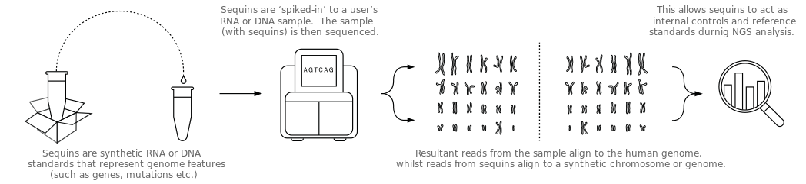

# Citation

* [1] Representing genetic variation with synthetic DNA standards.
*Nature Methods*, 2017
* [2] Spliced synthetic genes as internal controls in RNA
sequencing experiments. *Nature Methods*, 2016.
* [3] Reference standards for next-generation sequencing.
*Nature Reviews*, 2017.
* [4] Anaquin: a software toolkit for the analysis of spike-in controls
for next generation sequencing. *Bioinformatics*, 2017.

# Website

Visit our website to learn more about sequins:
[www.sequin.xyz](www.sequin.xyz).

# Overview

In this document, we show how to conduct statistical analysis that models the
performance of sequin controls in next-generation-sequencing (NGS) experiment.
We call the sequins **RnaQuin** for "RNA-Seq sequins", **MetaQuin** for
"metagenomic sequins", **VarQuin** for "genomics variant sequins", and the
statistical framework **Anaquin**.

This vignette is written for R-usage. However, Anaquin is a framework covering
the entire NGS workflow. Consequently, the R-package (and it's documentation) is a subset of
the overall Anaquin framework. We also distribute a detailed workflow guide on our website.

It is important to note Anaquin is both command-line tool and R-package.
Our workflow guide has the details on how the command-line tool can be used with
the R-package.

# Sequins

Next-generation sequencing (NGS) enables rapid, cheap and high-throughput
determination of sequences within a user’s sample. NGS methods have been
applied widely, and have fuelled major advances in the life sciences and
clinical health care over the past decade. However, NGS typically generates
a large amount of sequencing data that must be first analyzed and interpreted
with bioinformatics tools. There is no standard way to perform an analysis of
NGS data; different tools provide different advantages in different
situations. The complexity and variation of sequences further compound this
problem, and there is little reference by which compare next-generation
sequencing and analysis.

To address this problem, we have developed a suite of synthetic nucleic-acid
sequins (sequencing spike-ins). Sequins are fractionally added to the
extracted nucleic-acid sample prior to library preparation, so they are
sequenced along with your sample of interest. We can use the sequins as an
internal quantitative and qualitative control to assess any stage of the
next-generation sequencing workflow.



# Mixture

Sequins are combined together across a range of concentrations to formulate
a mixture. Mixture file (CSV) is a text file that specifies the concentration
of each sequin within a mixture. Mixture files are often required as input to
enable Anaquin to perform quantitative analysis. Mixture file can be
downloaded from our website.

Let's demonstrate RnaQuin mixture A with a simple example. Load the mixture
file (you can also download the file directly from our website):

```{r}
library('Anaquin')
data("RnaQuinIsoformMixture")
head(RnaQuinIsoformMixture)
```

Each row represents a sequin. *Name* gives the sequin names, *Length*
is the length of the sequins in nucleotide bases, *MixA* gives the
concentration level in attoml/ul for Mixture A.

Imagine we have two RNA-Seq experiments; a well-designed experiment and a
poorly-designed experiment. We would like to quantify their isoform expression.

Let's simulate the experiments:

```{r}
set.seed(1234)
sim1 <- 1.0 + 1.2*log2(RnaQuinIsoformMixture$MixA) + rnorm(nrow(RnaQuinIsoformMixture),0,1)
sim2 <- c(1.0 + rnorm(100,1,3), 1.0 +
          1.2*log2(tail(RnaQuinIsoformMixture,64)$MixA) +
          rnorm(64,0,1))
```

In the first experiment, sequins are expected to correlate linearly with the
measured FPKM. Indeed, the variables are strongly correlated:

```{r, message=FALSE, results='hide', fig.align='center'}
names <- row.names(RnaQuinIsoformMixture)
input <- log2(RnaQuinIsoformMixture$MixA)

title <- 'Isoform expression (Good)'
xlab  <- 'Input concentration (log2)'
ylab  <- 'Measured FPKM (log2)'

plotLinear(names, input, sim1, title=title, xlab=xlab, ylab=ylab)
```

In our second experiment, the weakly expressed isoforms exhibit stochastic
behavior and are clearly not linear with the input concentration. Furthermore,
there is a limit of quantification (LOQ); below which accuracy of the
experiment becomes questionable.

```{r, message=FALSE, results='hide', fig.align='center'}
names <- row.names(RnaQuinIsoformMixture)
input <- log2(RnaQuinIsoformMixture$MixA)

title <- 'Isoform expression (Bad)'
xlab  <- 'Input concentration (log2)'
ylab  <- 'Measured FPKM (log2)'

plotLinear(names, input, sim2, title=title, xlab=xlab, ylab=ylab)
```

The primary observation is that the artificial scale imposed by sequins allow
us to quantify our experiments.

# Quantifying transcriptome assembly

To quantify RNA-Seq transcriptome assembly, we need to run a transcriptome
assember; a software that can assemble transcripts and estimates their
abundances. Our workflow guide has the details.

Here, we use a data set generated by Cufflinks, described in **Section
5.4.5.1** in the user guide:

```{r}
data(UserGuideData_5.4.5.1)
head(UserGuideData_5.4.5.1)
```

The first column gives the input concentration for each sequin in attomol/ul.
The second column is the measured sensitivity. Run the following R-code to
generate a sensitivity plot.

```{r, message=FALSE, results='hide', fig.align='center'}
title <- 'Assembly Plot'
xlab  <- 'Input Concentration (log2)'
ylab  <- 'Sensitivity'

# Sequin names
names <- row.names(UserGuideData_5.4.5.1)

# Input concentration
x <- log2(UserGuideData_5.4.5.1$Input)

# Measured sensitivity
y <- UserGuideData_5.4.5.1$Sn

plotLogistic(names, x, y, title=title, xlab=xlab, ylab=ylab, showLOA=TRUE)
```

The fitted logistic curve reveals clear relationship between input
concentration and sensitivity. Unsurprisingly, the assembler has higher
sensitivity with highly expressed isoforms. The limit-of-assembly (LOA) is
defined as the intersection of the curve to sensitivity of 0.70.

# Quantifying gene expression

Quantifying gene/isoform expression involves building a linear model between
input concentration and measured FPKM. In this section, we consider a dataset
generated by Cufflinks, described in **Section 5.4.5.1** of the user guide.

Load the data set:

```{r}
data(UserGuideData_5.4.6.3)
head(UserGuideData_5.4.6.3)
```

The first column gives input concentration for each sequin in attomol/ul. The
other columns are the FPKM values for each replicate (three replicates in
total). The following code will quantify the first replicate:

```{r, message=FALSE, results='hide', fig.align='center'}
title <- 'Gene Expression'
xlab  <- 'Input Concentration (log2)'
ylab  <- 'FPKM (log2)'

# Sequin names
names <- row.names(UserGuideData_5.4.6.3)

# Input concentration
x <- log2(UserGuideData_5.4.6.3$Input)

# Measured FPKM
y <- log2(UserGuideData_5.4.6.3$Observed1)

plotLinear(names, x, y, title=title, xlab=xlab, ylab=ylab, showLOQ=TRUE)
```

Coefficient of determination is over 0.90; over 90% of the variation
(e.g. technical bias) can be explained by the model. LOQ is 3.78 attomol/ul,
this is the estimated emphirical detection limit.

We can also quantify multiple replicates:

```{r, message=FALSE, results='hide', fig.align='center'}
title <- 'Gene Expression'
xlab  <- 'Input Concentration (log2)'
ylab  <- 'FPKM (log2)'

# Sequin names
names <- row.names(UserGuideData_5.4.6.3)

# Input concentration
x <- log2(UserGuideData_5.4.6.3$Input)

# Measured FPKM
y <- log2(UserGuideData_5.4.6.3[,2:4])

plotLinear(names, x, y, title=title, xlab=xlab, ylab=ylab, showLOQ=TRUE)
```

# Differential analysis

In this section, we show how to quantify differential expression analysis
between expected fold-change and measured fold-change. We apply our method to
a data set described in **Section 5.6.3** of the user guide.

```{r}
data(UserGuideData_5.6.3)
head(UserGuideData_5.6.3)
```

For each of the sequin gene, we have expected log-fold change, measured
log-fold change, standard deviation, p-value, q-value and mean. The estimation
was done by DESeq2.

Run the following code to construct a folding plot:

```{r, results='hide', results='hide', fig.align='center'}
title <- 'Gene Fold Change'
xlab  <- 'Expected fold change (log2)'
ylab  <- 'Measured fold change (log2)'

# Sequin names
names <- row.names(UserGuideData_5.6.3)

# Expected log-fold
x <- UserGuideData_5.6.3$ExpLFC

# Measured log-fold
y <- UserGuideData_5.6.3$ObsLFC

plotLinear(names, x, y, title=title, xlab=xlab, ylab=ylab, showAxis=TRUE,
           showLOQ=FALSE)
```

Outliers are obvious throughout the reference scale. Overall, DESeq2 is able
to account for 78% of the variation.

We can also construct a ROC plot. [1] has details on how the true-positives
and false-positives are defined.

```{r, results='hide', fig.align='center'}
title <- 'ROC Plot'

# Sequin names
seqs <- row.names(UserGuideData_5.6.3)

# Expected ratio
ratio <- UserGuideData_5.6.3$ExpLFC

# How the ROC points are ranked (scoring function)
score <- 1-UserGuideData_5.6.3$Pval

# Classified labels (TP/FP)
label <- UserGuideData_5.6.3$Label

plotROC(seqs, score, ratio, label, title=title, refGroup=0)
```

AUC statistics for LFC 3 and 4 are higher than LFC 1 and 2. Overall, all LFC
ratios can be correctly classified relative to LFC 0.

Furthermore, we can construct limit of detection ratio (LOD) curves:

```{r, fig.align='center', results='hide', warning=FALSE}
xlab  <- 'Average Counts'
ylab  <- 'P-value'
title <- 'LOD Curves'

# Measured mean
mean <- UserGuideData_5.6.3$Mean

# Expected log-fold
ratio <- UserGuideData_5.6.3$ExpLFC

# P-value
pval <- UserGuideData_5.6.3$Pval

qval <- UserGuideData_5.6.3$Qval

plotLOD(mean, pval, abs(ratio), qval=qval, xlab=xlab, ylab=ylab, title=title, FDR=0.05)
```

Unsurprisingly, p-value is inverse quadratically related with average counts.
All the LFC ratios systematically outperform LFC 0. The function also estimates
the empirical detection limits, [1] has the details.
